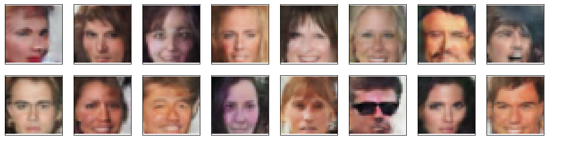

# Face Generation

This project is a part of the [Deep Learning Nanodegree](https://www.udacity.com/course/deep-learning-nanodegree--nd101) at [Udacity](https://www.udacity.com/).

-- Project Status: Completed

## Project Introduction

Define and train generative adversarial networks on a dataset of faces to get a generator network to generate new images of faces that look as realistic as possible!

## Methods Used

- Data Preprocessing
- Deep Convolutional Generative Adverserial Network

## Technologies

- Python3
- Anaconda or Miniconda
- Pickle
- Matplotlib
- Numpy
- OS
- Mock
- Jupyter Notebook

## Project Description

The purpose of this project is to generate new images of faces that look as realistic as possible. I defined a DCGAN and used [CelebFaces Attributes Dataset (CelebA)](http://mmlab.ie.cuhk.edu.hk/projects/CelebA.html) to train it.

After preprocessing and loading the data, I built the model and trained it for 50 epochs. Here is a sample of generated faces.

 

The generator is capable of creating images that could be recognized easily as human faces with the following weakness.

1. The generated images are noisy.

2. Most of the generated images are white celebrity faces which is a cause of the biased dataset.

3. The generated images contains adults only, no children images are generated due to the biased dataset that doesn't contain children images.

I think that training on more faces images of different ages, colors and expressions will result in more variety of faces that could be generated. The human faces are complex. So, I believe that using a deeper network with an increasing number of epochs enable the model to learn more features hence generates more realistic face images.

## Getting Started

1. Clone this repo (for help see this [tutorial](https://help.github.com/en/articles/cloning-a-repository)).
2. Install the above technologies
3. Create a new conda environment >> conda create --name deep-learning python=3
4. Enter the environment: (Mac/Linux) >> source activate deep-learning, (Windows) >> activate deep-learning
4. Run the following to open up the notebook server >> jupyter notebook
